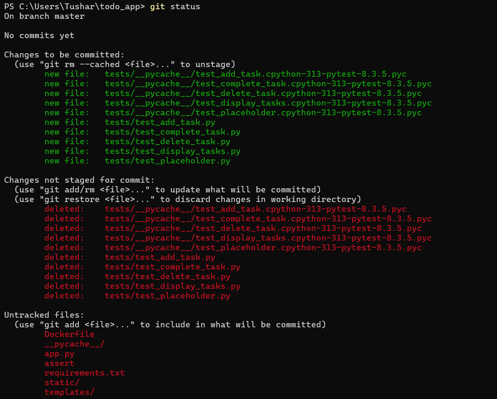
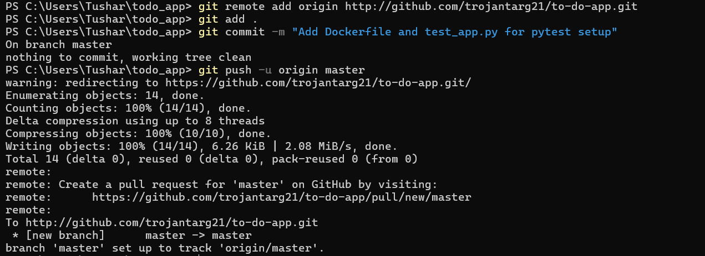
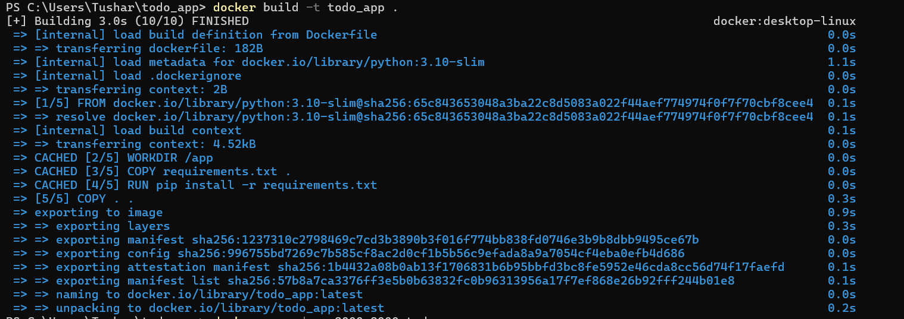
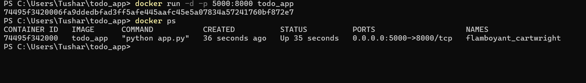
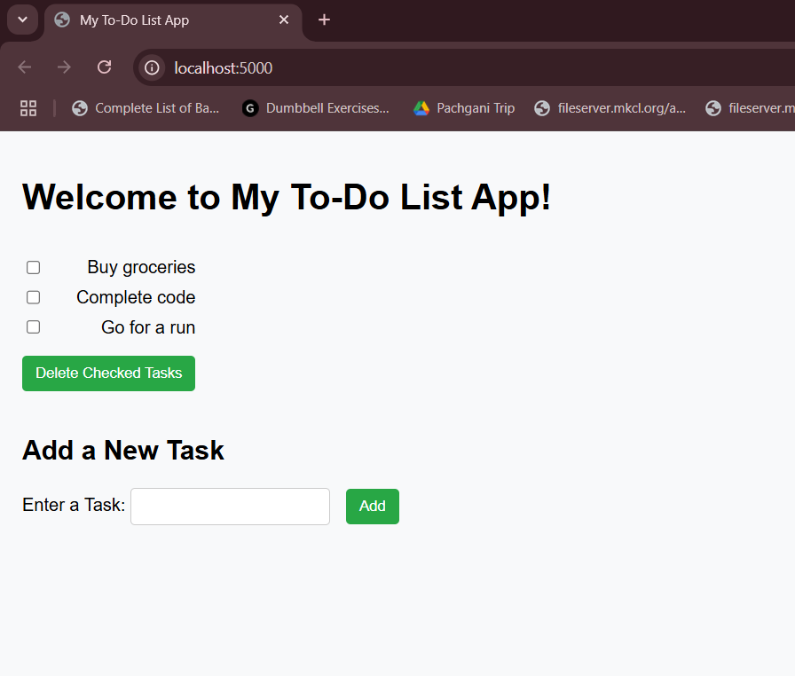
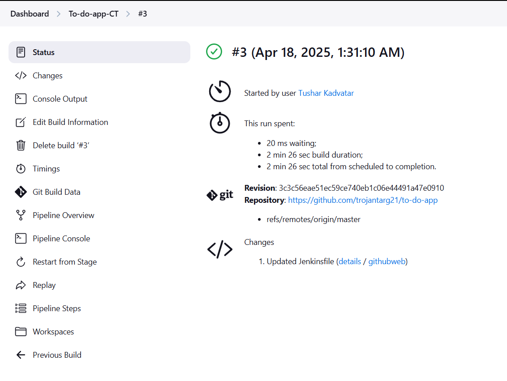
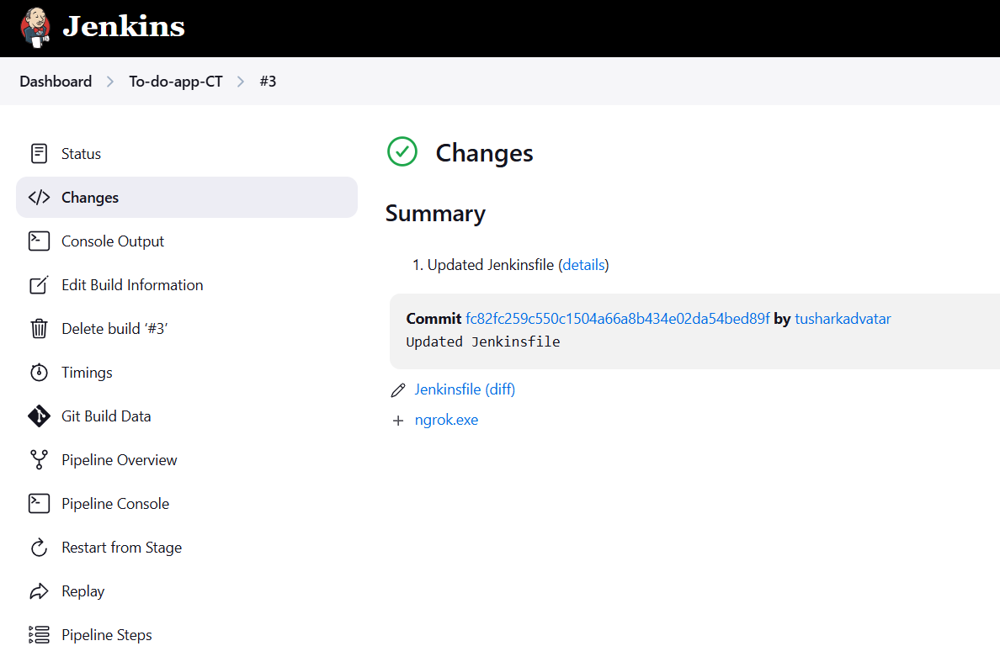

A simple and efficient to-do list application built with Flask (Python). The app allows users to create, update, and delete tasks, helping you stay organized and productive.

Table of Contents:
1. Features

2. Installation

3. Usage

4. Technologies

5. Running Tests

6. Docker Setup

7. Contributing

8. License

Features
1. Add tasks to your to-do list

2. Mark tasks as completed

3. Delete tasks

4. Simple, clean, and intuitive interface

Installation
   
Follow these steps to set up the project locally:

Clone the repository:
git clone https://github.com/trojantarg21/todo_app.git
cd todo_app

Install dependencies:
pip install -r requirements.txt

Usage
To start the Flask server locally, run:
python app.py
The app will run at http://localhost:5000.

Technologies
Flask: A lightweight Python web framework.

HTML/CSS: For creating the frontend user interface.

Running Tests
This project includes unit tests to ensure the app works as expected. To run the tests, use pytest.

Install pytest: If you don’t have pytest installed, you can install it by running:
pip install pytest

Run tests: To run the tests, execute the following command:
pytest

Docker Setup
This project also includes a Dockerfile to containerize the application. To build and run the app in Docker:

Build the Docker image:
docker build -t todo_app .

Run the Docker container:
docker run -p 5000:8000 todo_app
You can now access the app at http://localhost:5000.

Contributing

Fork the repository:
Create a new branch (git checkout -b feature/your-feature-name).

Make your changes:
Commit your changes (git commit -am 'Add your feature').
Push to the branch (git push origin feature/your-feature-name).
Open a pull request.

Challenges:
1.Version Control Conflicts: During the integration of new changes, there were merge conflicts, especially when pulling remote changes into the local repository. Learning how to resolve these conflicts manually helped me understand Git more deeply.

2.Setting Up Jenkins Pipeline: Configuring Jenkins to run the pipeline successfully was tricky due to issues with Git and Docker integration. However, after thorough troubleshooting, I was able to understand the importance of correct configuration in Jenkins and the need for Docker containers.

3.Dockerizing the App: Initially, the Docker setup was quite challenging because of dependencies and ensuring the app works seamlessly across different environments. Understanding Docker layers and the concept of multi-stage builds helped resolve these issues.

4.Writing Effective Unit Tests: Ensuring that the application functions as expected after modifications was a bit challenging initially, especially with Flask. The learning curve for understanding how to use pytest effectively was a rewarding experience.

Learnings:
1.Version Control Mastery: Working with Git extensively taught me how to handle versioning, branching, and merging efficiently, which will be valuable for collaborative projects in the future.

2.CI/CD with Jenkins: I learned the complete process of setting up continuous integration and delivery pipelines with Jenkins, understanding how to automate testing and deployment, which is critical for maintaining software quality.

3.Docker Fundamentals: I deepened my understanding of Docker, learning about image creation and containerization

4.Testing with pytest: Using pytest for testing and setting up test cases for the Flask application helped solidify the importance of automated testing in ensuring code quality.

5.Project Structure & Documentation: Organizing the project files correctly and maintaining proper documentation in the README has made me appreciate the importance of clean code and how it contributes to maintainability and collaboration.

Sample test output

Below are some sample screenshots of commiting changes to git:

Here are some screenshots showing the building of docker file, and running it on  the localhost:

And here are some screenshots of successful execution of testing pipeline script:

License
This project is licensed under the MIT License - see the LICENSE file for details.
